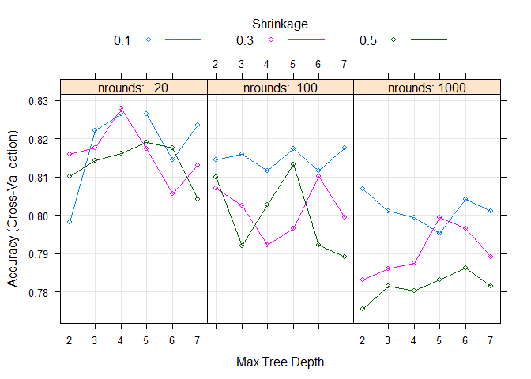
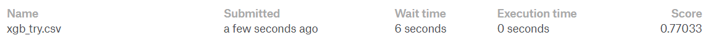
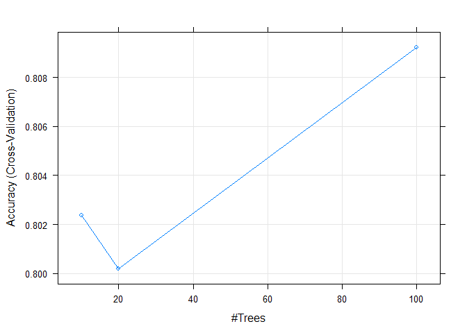
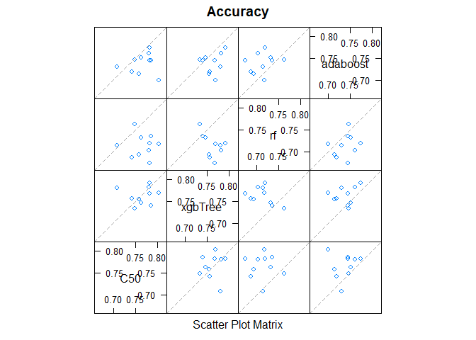
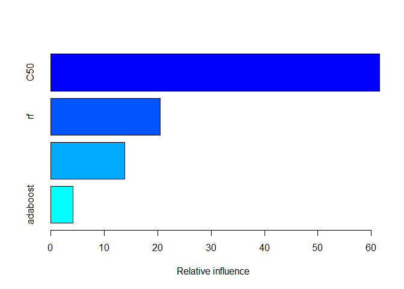

ex3
================
Simon
13 בנובמבר 2017

Setting up the datasets, seed and needed libs

``` r
setwd('C:\\Users\\User\\Downloads\\שיטות לניתוח מידע\\Titanic')
set.seed(7)
df = read.csv('train.csv', ,na.strings = "")
test_df = read.csv('test.csv', na.strings = '')
library(caret)
```

    ## Warning: package 'caret' was built under R version 3.4.2

    ## Loading required package: lattice

    ## Loading required package: ggplot2

    ## Warning: package 'ggplot2' was built under R version 3.4.2

``` r
library(caretEnsemble)
```

    ## Warning: package 'caretEnsemble' was built under R version 3.4.2

    ## 
    ## Attaching package: 'caretEnsemble'

    ## The following object is masked from 'package:ggplot2':
    ## 
    ##     autoplot

Remove columns that represents and index and convert some to factorial. To treat the cabin feature problem we just using the first letter and making it more general.

``` r
df <- df[,-c(1,4,9)]
df$Survived<- as.factor(df$Survived)
df$Pclass<- as.factor(df$Pclass)
df$Cabin <- substring(df$Cabin, 1, 1)
df$Cabin <- as.factor(df$Cabin)
df$Sex <- as.factor(df$Sex)
df$Embarked <- as.factor(df$Embarked)
```

Preper the test data

``` r
test_df$Pclass<- as.factor(test_df$Pclass)
test_df$Cabin <- as.factor(substring(test_df$Cabin, 1, 1))
test_df$Sex <- as.factor(test_df$Sex)
test_df$Embarked <- as.factor(test_df$Embarked)
ids <- test_df$PassengerId
test_df <- test_df[,-c(1,3,8)]
```

Split to test - train

``` r
indices <- sample(1:nrow(df),nrow(df)*0.75)
train<- df[indices,]
test<- df[-indices,]
```

Frist Model - XGB
=================

XGB - is a boosting method who uses the gradient descent algorithm for minimizing the training error

Set parameters for the model

``` r
control <- trainControl(method="cv", number=10)
metric <- "Accuracy"    
xgb_grid = expand.grid(.nrounds=c(20, 100, 1000),.max_depth=c(2, 3, 4, 5, 6, 7),.eta=c(0.1,0.3,0.5),.gamma=0.1,.colsample_bytree=0.5,.min_child_weight=0.01,.subsample=0.7)
```

Train the model

``` r
fit.xgb <- train(Survived~., data=train, method="xgbTree", metric="Accuracy", trControl=control,na.action = na.pass, tuneGrid = xgb_grid)
```

    ## Warning: package 'xgboost' was built under R version 3.4.2

    ## Warning: package 'plyr' was built under R version 3.4.2

Plot the results

``` r
summary(fit.xgb$results)
```

    ##       eta        max_depth       gamma     colsample_bytree
    ##  Min.   :0.1   Min.   :2.0   Min.   :0.1   Min.   :0.5     
    ##  1st Qu.:0.1   1st Qu.:3.0   1st Qu.:0.1   1st Qu.:0.5     
    ##  Median :0.3   Median :4.5   Median :0.1   Median :0.5     
    ##  Mean   :0.3   Mean   :4.5   Mean   :0.1   Mean   :0.5     
    ##  3rd Qu.:0.5   3rd Qu.:6.0   3rd Qu.:0.1   3rd Qu.:0.5     
    ##  Max.   :0.5   Max.   :7.0   Max.   :0.1   Max.   :0.5     
    ##  min_child_weight   subsample      nrounds          Accuracy     
    ##  Min.   :0.01     Min.   :0.7   Min.   :  20.0   Min.   :0.7755  
    ##  1st Qu.:0.01     1st Qu.:0.7   1st Qu.:  20.0   1st Qu.:0.7930  
    ##  Median :0.01     Median :0.7   Median : 100.0   Median :0.8049  
    ##  Mean   :0.01     Mean   :0.7   Mean   : 373.3   Mean   :0.8041  
    ##  3rd Qu.:0.01     3rd Qu.:0.7   3rd Qu.:1000.0   3rd Qu.:0.8156  
    ##  Max.   :0.01     Max.   :0.7   Max.   :1000.0   Max.   :0.8279  
    ##      Kappa          AccuracySD         KappaSD       
    ##  Min.   :0.5168   Min.   :0.02657   Min.   :0.06359  
    ##  1st Qu.:0.5507   1st Qu.:0.03236   1st Qu.:0.07597  
    ##  Median :0.5778   Median :0.03720   Median :0.08483  
    ##  Mean   :0.5751   Mean   :0.03772   Mean   :0.08609  
    ##  3rd Qu.:0.5964   3rd Qu.:0.04219   3rd Qu.:0.09773  
    ##  Max.   :0.6236   Max.   :0.04984   Max.   :0.11080

``` r
plot(fit.xgb)
```



Test the model

``` r
pred <- predict(fit.xgb,test, na.action = na.pass)
table(pred,test$Survived)
```

    ##     
    ## pred   0   1
    ##    0 123  26
    ##    1  13  61

``` r
mean(pred==test$Survived)
```

    ## [1] 0.8251121

Train a model for submmision with the best parameters

``` r
xgb_grid = expand.grid(.nrounds=20,.max_depth=4,.eta=0.3,.gamma=0.1,.colsample_bytree=0.5,.min_child_weight=0.01,.subsample=0.7)
fit.xgb_sub <- train(Survived~., data=df, method="xgbTree", metric="Accuracy", trControl=control,na.action = na.pass, tuneGrid = xgb_grid, savePredictions = TRUE)
```

Preper a file for submmision

``` r
new_pred<- predict(fit.xgb_sub,test_df,na.action = na.pass)
res <- cbind(PassengerId=ids,Survived=as.character(new_pred))
write.csv(res,file="xgb_try.csv",row.names = F)
```

Submission on kaggle 

Second - Adaboost
=================

Adaboost is a boosting techniqe for weak learners, it gives a weight for each learner and by that the overall output is better then other boosting methods.

Tarin a model with several params and see the results

``` r
fit.ada <- train(Survived~., data=df, method="adaboost",tuneGrid=expand.grid(.nIter=c(10L, 20L, 100L),.method="Adaboost.M1"),  metric=metric, trControl=control, na.action = na.pass)
```

    ## Warning: package 'fastAdaboost' was built under R version 3.4.3

``` r
plot(fit.ada)
```



``` r
fit.ada$results
```

    ##   nIter      method  Accuracy     Kappa AccuracySD    KappaSD
    ## 1    10 Adaboost.M1 0.8023786 0.5814880 0.02834573 0.06509258
    ## 2    20 Adaboost.M1 0.8002066 0.5810870 0.02053370 0.04925417
    ## 3   100 Adaboost.M1 0.8092081 0.5919866 0.02843932 0.06810749

Train a model with best params

``` r
fit.ada_sub <- train(Survived~., data=df, method="adaboost",tuneGrid=expand.grid(.nIter=10L,.method="Adaboost.M1"),  metric=metric, trControl=control, na.action = na.pass)
```

Output for submmision

``` r
new_pred<- predict(fit.ada_sub,test_df,na.action = na.pass)
res <- cbind(PassengerId=ids,Survived=as.character(new_pred))
write.csv(res,file="ada_try.csv",row.names = F)
```

Submission on kaggle 

Thired model - Ensamble
=======================

Preprocess data for Ensamble, replacing na with an apropiate value.

``` r
df_f <- df
levels(df_f$Survived)<-c("x0","x1")
df_f$Age[is.na(df_f$Age)] <- median(df_f$Age, na.rm = TRUE)
df_f$Cabin <- as.character(df_f$Cabin)
df_f$Cabin[is.na(df_f$Cabin)] <- 'x'
df_f$Embarked[is.na(df_f$Embarked)] <- 'S'

tset_f <- test_df
tset_f$Age[is.na(tset_f$Age)] <- median(tset_f$Age, na.rm = TRUE)
tset_f$Fare[is.na(tset_f$Fare)] <- median(tset_f$Fare, na.rm = TRUE)
tset_f$Cabin <- as.character(tset_f$Cabin)
tset_f$Cabin[is.na(tset_f$Cabin)] <- 'x'
tset_f$Embarked[is.na(tset_f$Embarked)] <- 'S'
```

Create an Ensamble and then stack it.

``` r
models <- caretList(
  Survived ~ .,
  df_f,
  allowParallel=TRUE,
  trControl = 
  trainControl(
    method = "cv",
    number = 10,
    savePredictions = 'final',
    classProbs=TRUE,
    index=createFolds(df_f$Survived, 10)
  ),
  metric = metric,
  tuneList = list(
        C50 = caretModelSpec(
      method = "C5.0",
      tuneGrid = data.frame(
        .trials = 4,
        .model = 'tree',
        .winnow = TRUE
      )
    ),
    xgbTree = caretModelSpec(
      method = "xgbTree",
      tuneGrid = data.frame(
        .nrounds=20,
        .max_depth=c(4,6),
        .eta=0.3,
        .gamma=0.1,
        .colsample_bytree=0.5,
        .min_child_weight=0.01,
        .subsample=0.7
      )
    ),
    rf = caretModelSpec(
      method = "rf",
      tuneGrid = data.frame(.mtry=1)
    ),
    adaboost = caretModelSpec(
      method = "adaboost"
    )
  )
)
```

    ## Warning: package 'C50' was built under R version 3.4.2

    ## Warning: package 'randomForest' was built under R version 3.4.2

    ## randomForest 4.6-12

    ## Type rfNews() to see new features/changes/bug fixes.

    ## 
    ## Attaching package: 'randomForest'

    ## The following object is masked from 'package:ggplot2':
    ## 
    ##     margin

``` r
gbm_ensemble <- caretStack(
  models,
  method="gbm",
  verbose=FALSE,
  tuneLength=10,
  metric="ROC",
  trControl=trainControl(
    method="boot",
    number=10,
    savePredictions="final",
    classProbs=TRUE,
    summaryFunction=twoClassSummary
  )
)
```

    ## Warning: package 'gbm' was built under R version 3.4.3

    ## Loading required package: survival

    ## 
    ## Attaching package: 'survival'

    ## The following object is masked from 'package:caret':
    ## 
    ##     cluster

    ## Loading required package: splines

    ## Loading required package: parallel

    ## Loaded gbm 2.1.3

Check model results

``` r
res <- resamples(models)
summary(res)
```

    ## 
    ## Call:
    ## summary.resamples(object = res)
    ## 
    ## Models: C50, xgbTree, rf, adaboost 
    ## Number of resamples: 10 
    ## 
    ## Accuracy 
    ##               Min.   1st Qu.    Median      Mean   3rd Qu.      Max. NA's
    ## C50      0.7069825 0.7503117 0.7705736 0.7646864 0.7817955 0.8029925    0
    ## xgbTree  0.7331671 0.7478180 0.7612219 0.7618130 0.7777431 0.7905237    0
    ## rf       0.6733167 0.6954489 0.7150873 0.7135580 0.7288030 0.7630923    0
    ## adaboost 0.6995012 0.7219451 0.7448537 0.7382475 0.7493766 0.7730673    0
    ## 
    ## Kappa 
    ##               Min.   1st Qu.    Median      Mean   3rd Qu.      Max. NA's
    ## C50      0.3149087 0.4636674 0.5097444 0.4876015 0.5317706 0.5726158    0
    ## xgbTree  0.4152687 0.4533954 0.4911216 0.4852315 0.5220376 0.5483992    0
    ## rf       0.1814031 0.2672809 0.3131626 0.3106203 0.3576382 0.4396558    0
    ## adaboost 0.3541810 0.4086982 0.4363396 0.4358374 0.4719118 0.5155976    0

``` r
modelCor(res)
```

    ##                  C50     xgbTree         rf  adaboost
    ## C50       1.00000000  0.07423596 -0.0410198 0.1176033
    ## xgbTree   0.07423596  1.00000000 -0.4682946 0.1948582
    ## rf       -0.04101980 -0.46829463  1.0000000 0.2462311
    ## adaboost  0.11760328  0.19485821  0.2462311 1.0000000

``` r
splom(res)
```



Output for submmision

``` r
summary(gbm_ensemble)
```



    ##               var   rel.inf
    ## C50           C50 61.544701
    ## rf             rf 20.478147
    ## xgbTree   xgbTree 13.829208
    ## adaboost adaboost  4.147945

``` r
new_pred<- predict(gbm_ensemble,newdata=tset_f, type="prob")
new_pred <- ifelse(new_pred>0.5, 1, 0)
result <- cbind(PassengerId=ids,Survived=as.character(new_pred))
write.csv(result,file="Ensamble_try.csv",row.names = F)
```

Submission on kaggle 

Best result was with the first model - XGB


